# Introduction to SolaceMonitor
*SolaceMonitor* is a custom-built application to collect, store and visualize the runtime statistics/ statuses of *Solace PubSub+ Message Brokers* for monitoring purposes. It consists of a bunch of Bash scripts and *Node.js* programs working together. It also relies on some open-source/ third party components for storing and visualizing those collected data. The *Node.js* programs can be run on any platform but the *Bash* scripts are only tested on Linux. Running on *macOS* or *Windows* are not supported.

*SolaceMonitor* requires *Grafana* and *InfluxDB* to work.

*SolaceMonitor* still uses *legacy SEMP* (XML over HTTP) for collecting data from *Solace PubSub+ Message Brokers*. *SEMPv2* is NOT currently supported as it is not feature-complete yet as of this writing.

# Architecture
*SolaceMonitor* is consisted of two *Node.js* programs (*pollrouter.js* and *postdb.js*) as the main components, a set of auxiliary *Bash* scripts, *InfluxDB* and *Grafana*. *pollrouter.js* polls all the Solace brokers to be monitored using *SEMP* in a pre-set interval. It then writes the reply documents into a temporary folder (*./processing/). *postdb.js* would then pick up those documents, parse them and inserts the needed statistics/ statuses into *InfluxDB*. *Grafana* dashboards are created to visualize all the saved data in *InfluxDB* to enable monitoring. Not only does *Grafana* support visualizing data from *InfluxDB*, it also supports reading from *Elasticsearch*. So, optionally, if the Solace PubSub+ brokers have been configured to forward the event log to *Elasticsearch* through *Logstash*, we can also visualize the log statistics in *Grafana* dashboards. 


Ideally, different statistics should be polled with different schedules. Some might be queried every 10 seconds and some might be queried every 30, 60 or 120 seconds. A single *pollrouter.js* is designed to poll the Solace brokers with a fixed interval. With different intervals configured for different statistics polling, multiple instances of *pollrouter.js* would need to be executed. Hence if we issue 

```
$ ps -ef | grep pollrouter.js
```

we would usually see more than one of them running (each one is responsible for a fixed interval polling like 10 sec, 30 sec, 60 sec and 120 sec):

```
soluser   30691     1 0 10:26 pts/0    00:00:34 node --stack-size=2000 pollrouter.js 10
soluser   30693     1 0 10:26 pts/0    00:00:34 node --stack-size=2000 pollrouter.js 30
soluser   30695     1 0 10:26 pts/0    00:00:34 node --stack-size=2000 pollrouter.js 60
soluser   30697     1 0 10:26 pts/0    00:00:34 node --stack-size=2000 pollrouter.js 120
```

The *SEMP* replies collected by different *pollrouter.js* instances would be put into their respective subfolders inside *./processing/* folder. The subfolders is named after their polling interval they represent:

```
./processing/10
./processing/30
./processing/60
./processing/120
```


The *SEMP* reply documents stored in those subfolders would then be picked up by *postdb.js*. There are same number of *postdb.js* running as the *pollrouter.js* each monitoring one of the processing subfolders. When new files come in, they would be picked up by the respective *postdb.js* instance and get processed. *SEMP* reply documents being processed would be put into the *./intermediate/* folder. After they're processed, they would be moved to the *./store* folder for archiving purpose.

In effect, there is one pair of *pollrouter.js* + *postdb.js* to process stats polling of a particular interval. This design guarantees a certain level of scalability. Between the two programs, *postdb.js* is the one consuming much more CPU resource as it has to parse and interpret the *SEMP* replies (XML). So, it is important to make sure that the processing speed of *postdb.js* can catch up with the reply files generated by *pollrouter.js*. To monitor this, the background script *queueprogress.sh* would check the number of outstanding *SEMP* reply files inside each of the *./processing/** directory every 2 seconds and write the result to *InfluxDB*. A *Grafana* dashboard would visualize the trend to better understand the performance of SolaceMonitor.

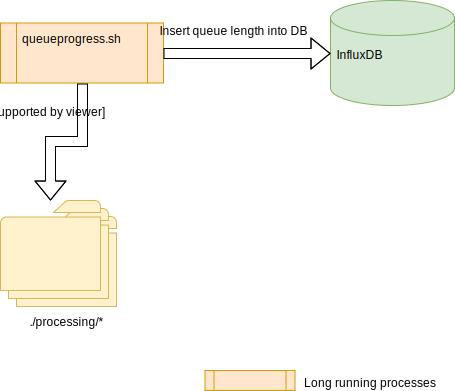

By design, all the processes of *SolaceMonitor* are supposed to be run on the same *Linux* server. In simplest case, even the *InfluxDB* would be running on the same server. It is important that the resource utilization of this server should be closely monitored. *SolaceMonitor* comes with a self-monitoring mechanism. Different metric of the server would be polled periodically and persists in *InfluxDB*. We can then monitor it in the *Grafana* dashboard as well. Currently, the resources to be monitored are:
- CPU utilization
- Memory utilization
- Network interface throughput
- Disk volume utilization


# Configuration Based
*SolaceMonitor* is mostly configuration based. The following things are configurable. Changes of code is not required:
- The message brokers to be monitored
- The specific objects of each broker to be monitored
- The specific SEMP commands to be sent to the message brokers and their send frequency
- The way each SEMP reply is to be parsed and inserted into DB

*pollrouter.js* relies on *./config/config.json* to know which message brokers are to be monitored and hence polled. The *SEMP* command templates it relies on are residing on the *./cmd* directory. Each of the command template files are named *\*cmdlist*. For example, the message VPN related *SEMP* command templates are inside *mvpncmdlist* file. Each line in the template files represent one command template. It contains the command template as well as the polling frequency and command ID. For details, please to the *Reference* section. For each *\*cmdlist* file, there is a corresponding *\*list* file inside the *./config* directory to indicate which objects each *SEMP* command should be sent for. For example, *mvpnlist* would contain all the message VPN across all brokers that are needed to be monitored. Another file *pollrouter.js* needs is the *./cmd/pollingInstructions.json*. It contains the instruction on how to process each of the *\*cmdlist* files. It is not supposed to be modified by users.

*postdb.js* relies on *./config/config.json* to know the *InfluxDB* user credential. Without this information, it can't send the parsed metrics into the database. It also relies on the *./cmd/processingInstructions.json* file for instructions to handle each type of SEMP replies according to the command ID. This file again is not supposed to be modified by users.

As a general guideline, users are only supposed to change the files in the *./config* directory.


Please note that the Grafana dashboards are not configuration. When there are new metrics to be monitored, the dashboards might need to be updated or new dashboards added.

# Content of SolaceMonitor Package
## Main programs
+ *pollrouter.js* - The Node.js program that processes the set of preconfigured commands (see below) and poll statistics (SEMP responses) from Solace Message Routers and saves them to local filesystem for further processing by *postdb.js*.
+ *postdb.js*     - The Node.js program that processes the SEMP responses and post the filtered dataset to *InfluxDB*.

## Auxiliary scripts
+ *start.sh* - To start all SolaceMonitor service. This script starts *pollrouter.js* and *postdb.js* and other auxiliary scripts. For each process started, their *PID* would be written to the *pid.file* for monitoring by the *checkAndRestart.sh* script.
+ *stop.sh* - To stop the SolaceMonitor service. This script *pkill* all scripts started by *start.sh*.
+ *compress.sh* - The script compresses the processed SEMP responses for archival purpose. It is a long running process.
+ *queueprogress.sh* - The script checks the current SEMP processing queue depth of the polled data periodically and sends to *InfluxDB*. It's a long running process.
+ *cq.sh* - The script inserts continuous queries into influxdb. Continuous queries are used for archiving the fine-grained measurments into coarse-grained measurments. It shall be executed once during setup or on any future addition to the InfluxDB measurements. It relies on the *cmd/cqcmdlist* for the actual query syntax and *config/cqmeasurementlist* for the measurements on which the queries would be created.
+ *interfacestat.sh* - This script polls the TX/RX values of the specified network interface periodically on the host running the *SolaceMonitor* service and sends the values to *InfluxDB*. It is started by *start.sh* and is a long running process.
+ *pingrouter.sh* - The script gives an estimate on the network RTT from the *SolaceMonitor* host to the Solace Message Brokers to be monitored. The obtained RTT is inserted into *InfluxDB*
+ *checkAndRestart.sh*  - The script scans the *pid.file* generated by *start.sh*, checks if any processes listed in the file are not running, and then starts them. It's for making sure all the required processes are running. If *pid.file* file is not found, it would not do anything. The script is executed by *crontab* or the *run.sh* script (only if *SolaceMonitor* is running as a container).
+ *run.sh* - This command is used when *SolaceMonitor* is deployed as a *Docker Container*. This should be the *CMD* for the container. Essentially, it merely invokes *start.sh* and calls *checkAndRestart.sh* in an endless loop.
+ *sendsempcmds.sh* - The script sends all the SEMP commands listed in the *cmd/maintenancecmdlist* to all routers listed in *config/system.config*. It is used for clearing the client and SSL stats.  It can potential be used for sending other admin commands to the routers. It is triggered by *crontab*.
+ *createBridgelist.sh* - The script scan all the routers listed in *config/system.config* for all the bridges configured and generate a *bridgelist* file. It's used during the setup process.
+ *createOldConfig.sh* - This script generates the */config/system.config* (used by *Bash* scripts) from the */config/config.json* (used by *Node.js* programs). It would be invoked by *start.sh* and doesn't need to be executed manually.

## Configuration files
Configuration files listed here contains all the objects to be monitored in a particular Solace environment. They shall be modified/created before starting SolaceMonitor service. For those not relevant to the current environment, the relevant files can be empty.

+ *config.json* - It is the master configuration file for *SolaceMonitor*. It contains the list of all *Solace PubSub+* instances to be polled, *InfluxDB* URL and login credential, other environment specific parameters. It's for used by all *Node.js* programs like *pollrouter.js* and *postdb.js*.
+ *system.config* - This file repeats the information in *config.json* file in `<key>=<value>` format. All Bash scripts of SolaceMonitor would read this file for their needed parameters. This file would be generated automatically when *start.sh* is executed. There is no need to generate this file manually.
+ *mvpnlist* - The list contains the Message VPNs to be polled. It is used in conjunction with the *mvpncmdlist* file.
+ *clientlist* - The list contains the client-names (exact name match) to be polled. It is used in conjunction with the *clientcmdlist* file.
+ *cachelist*- The list contains the *SolCache* instances to be polled. It is used in conjunction with the *cachecmdlist* file.
+ *clientpatternlist*  - The list contains the prefixes of the client names to be polled. It is used in conjunction with the *clientpatterncmdlist* file.
+ *clientusernamelist* - The list contains the client usernames to be polled. It is used in conjunction with the *clientusernamecmdlist* file.
+ *bridgelist* - The list contains the message VPN bridges to be polled. It can be generated by running the *createBridgelist.sh* script. It is used in conjunction with the *bridgecmdlist* file.
+ *queuelist* - The list contains the queue endpoints to be polled. It is used in conjunction with the *queuecmdlist* file.
+ *cqmeasurementlist* - The list contains all the measurements to be downsampled. It's used by *cq.sh*. Although the file is located in *./config* directory, it is not meant to be edited by users.

## Command template files
The files listed all the SEMP commands to be issued to the Solace routers for polling of statistics and runtime status. They shall not be edited by the users. Any addition or modification shall involve changing the *pollrouter.js* and *postdb.js* programs or their configuration files.

+ *cmdlist* - The list contains system/router level command templates and their respective polling intervals.
+ *mvpncmdlist* - The list contains message vpn level command templates and their respective polling intervals.
+ *cachecmdlist* - The list contains *SolCache* related command templates and their respective polling intervals.
+ *clientcmdlist* - The list contains clientname related command templates and their respective polling intervals.
+ *clientusernamecmdlist* - The list contains client username related command templates and their respective polling intervals.
+ *clientpatterncmdlist*  - The list contains prefixed client-name related command templates and their respective polling intervals.
+ *bridgecmdlist* - The list contains message VPN bridge related command templates and their respective polling intervals.
+ *queuecmdlist* - The list contains the queue endpoint related command templates and their respective polling intervals. 
+ *maintenancecmdlist* - The maintenance commands to be invoked by *sendsempcmds.sh* script.
+ *cqcmdlist* - The list contain continuous queries command templates for *InfluxDB*. It does not contain any SEMP command templates. It is used by *cq.sh*

## Directories
+ *./processing* - This directory stores the polled SEMP response. The responses are grouped by polling time interval. Each time interval is a sub directory. There is special sub-directory *alert* for capturing alerts sent by *Grafana*. This directory would be automatically generated by *start.sh* if it's not already there.
+ *./intermediate* - This directory stores SEMP response files being processed by any of the *postdb.js* instances at the moment. After a file has been processed, it would be moved to the *store* directory. This directory would be automatically generated by *start.sh* if it's not already there.
+ *./store* - This directory stores the processed SEMP responses for archival purposes. These responses files would be compressed periodically to minimize storage requirement by the *compress.sh* script. Older compressed files would then be cleaned up periodically by the same script. This directory would be automatically generated by *start.sh* if it's not already there.
+ *./dashboards* - This directory contains *Grafana* dashboards of the *SolaceMonitor* solution. It is meant for first time setup.
+ *./log* - This directory contains the log files generated by all the running scripts. It should be managed by *logrotate* and shouldn't need any maintenance.
+ *./cmd* - This directory contains all the SEMP command files used by *pollrouter.js*. Files in this directory is NOT meant to be modified by users.
+ *./config* - This directory contains all the configuration files to be modified for a particular *Solace PubSub+* environment.

# Required hardware
In most cases, a modern 4-core CPU machine with 16-32GB of RAM running CentOS 7 or 8 shall be sufficient to run *SolaceMonitor*, *InfluxDB* and *Grafana*. The disk storage requirement depends a lot of the number of *Solace PubSub+* instances to be monitored and the retention policies configured in *InfluxDB*.

In general, a disk size of 500GB minimum is required. If there is a large number of *Solace PubSub+* instances/ appliances to be monitored, the requirement might have to be adjusted. Load test should be carried out before the correct configuration and sizing could be arrived at.

# Required software
*Grafana* and *InfluxDB* are required. The Open Source version of both are sufficient to run SolaceMonitor. For better resilience and performance, Enterprise versions are recommended. Both *Grafana* and *InfluxDB* can be installed on the same machine running the *SolaceMonitor* package. For better scalability, each component can also run on separate machines. If the exact loading is not known yet, start with a single machine as suggested in the *Required hardware* section.

*Grafana v6.X* and *InfluxDB 1.7.X* have been tested to work with the *SolaceMonitor* solution. Other versions are not tested.

*Node.js* is needed for running *pollrouter.js* and *postdb.js*. *SolaceMonitor* has been tested to work with version v10.15.3. Other versions are not tested. Installation of *Node.js* with *nvm* is recommended.

The *SolaceMonitor* package is recommended to be installed on the same machine as *InfluxDB* for performance reason. Normally, the package uses little CPU and memory. However, it keeps pulling data from *Solace PubSub+* instances and inserting into *InfluxDB*. Having *SolaceMonitor* co-located with *InfluxDB* can reduce the network traffic and hence the execution efficiency.

The following additional Linux packages are also required:

+ *xmllint, sed, awk, jq*  - Some Bash scripts require *xmllint*, *sed* and *awk* for processing SEMP response messages. *jq* is for the processing of JSON files.
+ *curl* - All HTTP requests are sent using *curl* in Bash scripts.

For *grafana*, the following plugin is needed:

+ grafana-piechart-panel

To install the *grafana* plugin, here is an example (login as root):

    # grafana-cli plugins install grafana-piechart-panel

It shall be noted that all servers and *Solace PubSub+* shall be NTP synced.


# Setup
## Native Host Deployment (Non Docker Deployment)
Assume that *InfluxDB*, *Grafana* and *Node.js* have been installed, follow the steps below to setup *SolaceMonitor*:

1. Create the InfluxDB database for storing all the collected metrics/ measurements, example:
   ```
   $ influx
   Connected to http://localhost:8086 version v1.7.9
   InfluxDB shell version: v1.7.9
   > create database solacemonitor
   > use solacemonitor
   Using database solacemonitor
   > create user solace with password 'abc123'
   > grant all on solacemonitor to solace
   ```

2. Create the retention policy for live data. Assume that data would be stored for 14 days:
    ```
    CREATE RETENTION POLICY "live" ON "solacemonitor" DURATION 14d REPLICATION 1 default
    ```

3. Create the retention policy for longer term storage (archived data). Assume that it would store 90 days of data:
    ```
    CREATE RETENTION POLICY "archive" ON "solacemonitor" DURATION 90d REPLICATION 1
    ```

4. Put SolaceMonitor into a directory of choice. For example:

    ```
    $ cd /ap
    $ tar xvzf /tmp/solacemon.tar.gz
    ```

5. Create the *config/config.json* file with the needed runtime parameters. Specifically, the URL of the *Solace PubSub+* instances to be monitored, *InfluxDB* URL and credential, *InfluxDB* retention policy and the network interface of the *Linux* node running the *SolaceMonitor* service to be monitored. A sample of the file can be found at *config/config.json.template*. An example of the *config.json* file is shown here as a reference
    ```
    $ cat config/config.json
    {
      "solaceHosts": [
        {"url": "10.0.2.1:80", "username": "admin", "pwd": "admin", "sempVer": "soltr/8_4_0"},
        {"url": "10.0.2.2:80", "username": "admin", "pwd": "admin", "sempVer": "soltr/8_4_0"}
      ],
      "influxDB": {
        "db": "solacemonitor",
        "username": "solace",
        "pwd": "solace",
        "host": "localhost:8086",
        "continuousQuery": {
          "duration": "5m",
          "rpd": "archive",
          "rp": "live",
          "adminUser": "admin",
          "adminPassword": "admin"
        }
      },
      "interface_stat": {
        "networkInterface": "eth0"
      }
    }
    ```

6. Create all the list files as mentioned in the *Configuration files* section according to the monitoring need. All files have the associated *.template* file as examples in the *config/* directory. For generating the *bridgelist* for all bridges in all routers, execute the *createBridgelist.sh* script. For generating the *cachelist*, execute the script *createCacheList.sh*. Example:
    ```
    $ ./createCacheList.sh > config/cachelist
    $ ./createBridgeList.sh > config/bridgelist
    ```

7. Set up cron jobs below (assume that SolaceMonitor is in */ap/solacemon*)
    ```
    # compress.sh compresses the processed SEMP response files in the ./store directory (obsoleted)
    #*/5 * * * * cd /ap/solacemon;./compress.sh
    # pingrouter.sh pings the configured Solace PubSub+ instances to get the RTT into InfluxDB (obsoleted)
    #*/2 * * * * cd /ap/solacemon;./pingrouter.sh
    # checkAndRestart.sh makes sure that all the essential processes are running
    * * * * * cd /ap/solacemon;./checkAndRestart.sh > log/checkAndRestart.log 2>&1
    # sendsempcmds.sh executes the commands in maintenancecmdlist, the primiary motivation is to
    # clear the router client stats daily
    0 0 * * * cd /ap/solacemon;./sendsempcmds.sh > log/sendsempcmds.log 2>&1
    # using find command to house-keep the ./store directory (obsoleted)
    #0 0 * * * find /ap/solacemon/store/*.tgz -mtime +14 -exec rm -f {} \;
	```

8. Set Up *logrotate* to ease log file maintenance
    1. Login as root to the Linux machine

    2. Add the following block to the */etc/logrotate.conf* file (change the directory path and *su* user/ group as needed):
	
        ```
        /ap/solacemon/log/*.log {
            size 20M
            rotate 10
            copytruncate
            nodateext
            missingok
            notifempty
            su soluser soluser
        }
        ```
			
    3. Execute the following to make logrotate to run every hour (optional but recommended):
        ```
        # cp -p /etc/cron.daily/logrotate /etc/cron.hourly
        ```
9. Set up the continuous queries in Influxdb to perform data archiving
    ```
    $ ./cq.sh
    ```

## Docker Deployment
Assume that *InfluxDB*, *Grafana* and *Docker* have been installed, follow the steps below to setup *SolaceMonitor*:

1. Create the InfluxDB database for storing all the collected metrics/ measurements, example:
   ```
   $ influx
   Connected to http://localhost:8086 version v1.7.9
   InfluxDB shell version: v1.7.9
   > create database solacemonitor
   > use solacemonitor
   Using database solacemonitor
   > create user solace with password 'abc123'
   > grant all on solacemonitor to solace
   ```

2. Create the retention policy for live data. Assume that data would be stored for 14 days:
    ```
    CREATE RETENTION POLICY "live" ON "solacemonitor" DURATION 14d REPLICATION 1 default
    ```

3. Create the retention policy for longer term storage (archived data). Assume that it would store 90 days of data:
    ```
    CREATE RETENTION POLICY "archive" ON "solacemonitor" DURATION 90d REPLICATION 1
    ```

4. Put SolaceMonitor into a directory of choice. For example:
    ```
    $ cd /ap
    $ tar xvzf /tmp/solacemonitor.tar.gz
    ```

5. Create the sub directories to be mapped to the docker container. Example:
    ```
    $ cd solacemon
    $ mkdir -p processing
    $ mkdir -p store
    $ mkdir -p log
    ```
   
6. Load the *SolaceMonitor* docker image. Example:
   ```
    $ docker load --input /tmp/solacemonitor-docker.tar
    ```

7. Create the *config/config.json* file with the needed runtime parameters. Specifically, the URL of the *Solace PubSub+* instances to be monitored, *InfluxDB* URL and credential, *InfluxDB* retention policies (must match the retention policies we've just created) and the network interface of the *Linux* node running the *SolaceMonitor* service to be monitored. A sample of the file can be found at *config/config.json.template*. An example of the *config.json* file is shown here as a reference
    ```
    $ cat config/config.json
    {
      "solaceHosts": [
        {"url": "10.0.2.1:80", "username": "admin", "pwd": "admin", "sempVer": "soltr/8_4_0"},
        {"url": "10.0.2.2:80", "username": "admin", "pwd": "admin", "sempVer": "soltr/8_4_0"}
      ],
      "influxDB": {
        "db": "solacemonitor",
        "username": "solace",
        "pwd": "solace",
        "host": "localhost:8086",
        "continuousQuery": {
          "duration": "5m",
          "rpd": "archive",
          "rp": "live",
          "adminUser": "admin",
          "adminPassword": "admin"
        }
      },
      "interface_stat": {
        "networkInterface": "eth0"
      }
    }
    ```

8. Create the docker container. Example (assume that SolaceMonitor is in */ap/solacemon*):
    ```
    $ docker create --network host --name solacemonitor \
    -v /ap/solacemon/config/:/app/config/ \
    -v /ap/solacemon/processing/:/app/processing/ \
    -v /ap/solacemon/store/:/app/store/ \
    -v /ap/solacemon/log/:/app/log/ \
    -e TZ=Asia/Taipei lwyic/solace-monitor
    ```

9. Start the docker container
    ```
    $ docker container start solacemonitor
    ```

10. Create all the list files as mentioned in the *Configuration files* section according to the monitoring need. All files have the associated *.template* file as examples in the *config/* directory. For generating the *bridgelist* for all bridges in all routers, execute the *createBridgelist.sh* script. For generating the *cachelist*, execute the script *createCacheList.sh*. Please note that they can be executed inside or outside of the container. Example for running inside of the container:
    ```
    $ docker exec -it solacemonitor bash
    # ./createCacheList.sh > config/cachelist
    # ./createBridgeList.sh > config/bridgelist
    ```
    For running on the host machine:
    ```
    $ ./createCacheList.sh > config/cachelist
    $ ./createBridgeList.sh > config/bridgelist
    ```

11. (Optiona) To change the restart policy so that the docker container would restart by itself if the machine is restarted. Example:
    ```
    $ docker update --restart unless-stopped solacemonitor
    ```

12.  Set up cron jobs on the docker host as below (assume that SolaceMonitor is in */ap/solacemon*)
    ```
    # compress.sh compresses the processed SEMP response files in the ./store directory (obsoleted)
    #*/5 * * * * cd /ap/solacemon;./compress.sh
    # pingrouter.sh pings the configured Solace PubSub+ instances to get the RTT into InfluxDB (obsoleted)
    #*/2 * * * * cd /ap/solacemon;./pingrouter.sh
    # sendsempcmds.sh executes the commands in maintenancecmdlist, the primiary motivation is to
    # clear the router client stats daily (optional)
    # 0 0 * * * cd /ap/solacemon;./sendsempcmds.sh > log/sendsempcmds.log 2>&1
    # using find command to house-keep the ./store directory (obsoleted)
    #0 0 * * * find /ap/solacemon/store/*.tgz -mtime +14 -exec rm -f {} \;
	```

13.  Set Up *logrotate* on the docker host to ease log file maintenance
    1. Login as root to the host Linux machine

    2. Add the following block to the */etc/logrotate.conf* file (change the directory path and *su* user/ group as needed):
	
        ```
        /ap/solacemon/log/*.log {
            size 20M
            rotate 10
            copytruncate
            nodateext
            missingok
            notifempty
            su soluser soluser
        }
        ```
			
    3. Execute the following to make logrotate to run every hour (optional but recommended):
        ```
        # cp -p /etc/cron.daily/logrotate /etc/cron.hourly
        ```

14. Set up the continuous queries in Influxdb to perform data archiving
    ```
    $ ./cq.sh
    ```

# Running SolaceMonitor
## For Native Host Deployment (Non Docker Deployment)
1. Make sure that *Grafana* and *InfluxDB* are already running.
2. Go into the *SolaceMonitor* directory.
3. Execute
    ```
    $ cd /ap/solacemon
    $ ./start.sh
    ```
4. Check the logs in the *logs* directory for any error messages

## For Docker Deployment
1. Make sure that *Grafana* and *InfluxDB* are already running.
2. Execute
    ```
    $ docker container start solacemonitor
    ```
3. Check if it is been started
    ```
    $ docker container ls
    ```
4. Check the logs in the *logs* directory for any error messages

# Stopping SolaceMonitor
## For Native Host Deployment (Non Docker Deployment)
1. Execute
    ```
    $ cd /ap/solacemon
    $ ./stop.sh
    ```
## For Docker Deployment
1. Execute
    ```
    $ docker container stop solacemonitor
    ```

# FAQ
## How to add a new message VPN to the monitor
If a new message VPN is created on the routers and is needed to be monitored, follow the following steps:

1. Edit the *config/mvpnlist* file
2. Append the VPN to the the file using this syntax
    ```
    <router-name> <message-vpn-name>
3. If there are more than one routers having the new message VPN and they all need to be monitered, repeat step 2 for each router.

## What is the difference between clientpatternlist and clientlist
While both lists contain the client names to be monitored, they have subtle differences. Names listed in *clientlist* has to be the full client names to be monitored. If the application use a fixed client name when connecting to Solace, that client name should be put into *clientlist*.

However, if the client name is automatically generated by the API. Its client name would be different on every connection. It would be started with the application's host name and with some random strings at the end. If those clients are to be monitored, they can be added to *clientpatternlist*. Names listed in *clientpatternlist* are the prefix of the actual client names. To monitor those clients with auto-generated client names, put their respective host name into the list (we can check the client name). If the client name is generated by the applciation but is always having a fixed prefix, that prefix can also be added to this list. It follows the format of "\<router-name\> \<message-vpn-name\> \<client-name-prefix\>". Here is an example:
```
solace vpn1 apphost01
```

## How to monitor queue endpoints
Queue endpoints to be monitored are listed in the *queuelist* configuration file. Each queue to be monitored has to be appended to this file. The entries in the file is having the format of "\<router-name\> \<message-vpn-name> \<queue-endpoint-name\>". Here is an example:
```
solace vpn1 q/test/a/b/c
```
While there isn't a limit on how many queue endpoints can be monitored, it shall be noted that each queue entered in the file would result in one SEMP polling.

## How to change the polling interval for a particular SEMP polling
1. Edit the relevant **cmdlist* in the *cmd* directory.
2. The second field (space separated) on each row is the time interval in second. Change it to the disred values. It is recommended that the time should be on the "30" second boundary. i.e. 30, 60, 90, 120...
3. Stop all processes by executing the *stop.sh* script.
4. Wait for one minute. *checkAndRestart.sh* script would start the stopped processes automatically.

## How to properly stop the SolaceMonitor service
1. Execute *stop.sh*

## Changed the retention policies of InfluxDB for SolaceMonitor data
SolaceMonitor stores the real time data from SEMP responses for a period of time defined by the default retention policy of the database. At the same time, 5-minute down-sampled data would be stored with another retention policy which keeps the data on a longer term. The two retention policies can be changed any time. The following example uses two retention policies "live" (short term) and "archive" (longer term) as an example:

1. Invoke the InfluxDB command line interface
    ```
    $ influx
    Connected to http://localhost:8086 version v1.7.1
    InfluxDB shell version: v1.7.1
    Enter an InfluxQL query
    > auth
    username: admin
    password: 
    > use solacemonitor
    Using database solacemonitor
    ```
2. Use ALTER clause to modify the retention policy for live data. Assume changing it to 28 days:
    ```
    ALTER RETENTION POLICY "live" ON "solacemonitor" DURATION 28d REPLICATION 1 default
    ```
3. Use ALTER clause to modify the retention policy for longer term storage. Assume changing it to 90 days:
    ```
    ALTER RETENTION POLICY "archive" ON "solacemonitor" DURATION 90d REPLICATION 1
    ```

For details, please refer to the InfluxDB documentation in this link: https://docs.influxdata.com/influxdb/v1.7/query_language/database_management/#modify-retention-policies-with-alter-retention-policy

## Installing *InfluxDB* and *Grafana* with Docker
The following scripts give an example of how to install *InfluxDB* and *Grafana* as Docker containers. For the sake of simplicity, the containers are configured to run using the host network. As we need to install extra plugins for *Grafana*, its container should be configured to access the internet (check the HTTP_PROXY environment variable).
```
# docker volume create influxdb-data

# docker create --network host --name influxdb \
  -v influxdb-data:/var/lib/influxdb \
  -e "INFLUXDB_ADMIN_USER=admin" \
  -e "INFLUXDB_ADMIN_PASSWORD=admin" \
  -e "INFLUXDB_HTTP_AUTH_ENABLED=true" \
  -e TZ=Asia/Taipei \
  influxdb:1.7.8

# docker volume create grafana-data

# docker create --network host --name grafana \
  -v grafana-data:/var/lib/grafana \
  -e "GF_SECURITY_ADMIN_PASSWORD=admin" \
  -e "GF_INSTALL_PLUGINS=grafana-piechart-panel" \
  -e "HTTP_PROXY=http://10.229.2.41:8080" \
  -e TZ=Asia/Taipei \
  grafana/grafana:6.4.1

# docker update --restart unless-stopped grafana influxdb
```

*InfluxDB* and *Grafana* configured in this way would store all user data the Docker volumes created. When moving the container to another machine, remember to move the Docker volumes as well.

Then create an InfluxDB datasource in Grafana named "SolaceMonitor". Then import all the needed dashboards into Grafana from the *./dashboards/* folder

# Grafana Dashboards
## Overview
SolaceMonitor is consisted of the following major *Grafana* dashboards:
- Operator View
- System Level Stats
- VPN Level Stats
- Interface Stats
- SolCache Level Stats
- Bridges Stats
- SolaceMonitor Performance
- InfluxDB Performance

For each dashboard, *Grafana* provides users with the ability to choose the viewing window (the time range for the charts on the page) and the refresh rate (the time the page would be refreshed automatically). Users can choose to visualize the data for a particular period of time or for the last X minutes/ hours or days. If last X is chosen, users can further choose how often the page is refreshed.

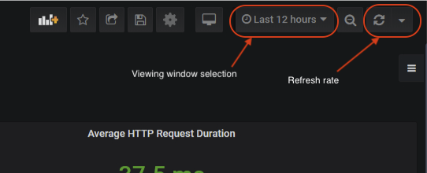

The following sections explains what're contained in each of the dashboards.

## Operator View
The *Operator View* dashboard provides a one page quick snapshot on the healthiness of all the monitored *Solace PubSub+ Message Brokers*. It is intended to be used in a monitoring room where operators are keeping an eye on the healthiness of all running systems (not limited to Solace).

The top-most pane of the page displayed any alerts currently raised. Alerts here refer to all the alerts configured in specific *Grafana* chart across all the dashboards. Currently, only the charts in *Operator View* have alerts configured. They are specifically the ingress/ egress byte rate alert for all the monitored Solace brokers.

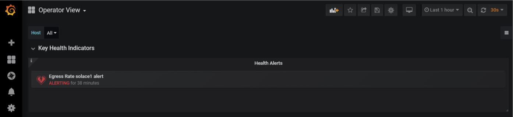

The next pane on the page shows two rows of gauges. The top row shows the number of warning, error or critical events emmitted by each Solace broker for the last hour. The information in retrieved from the event.log indexed in Elasticsearch. On the top left corner of each gauge in this row, there is a "Details" link linking to the *Issues Count View* dashboard.

The bottom row of gauges shows ingress/ egress rates and the number of clients connected for each Solace broker at the moment (recent 10 secs). They are displayed as gauges for easy viewing. The different coloured (green, yellow and red) zones can be configured to the need of the users.


Although the gauges provides a quick view on the current metrics, they don't show the varation over time. The third pane shows the ingress/ egress rates for all Solace brokers on the same line charts. They are intended to give the users a sense on the ingress/ egress rates variation over time.

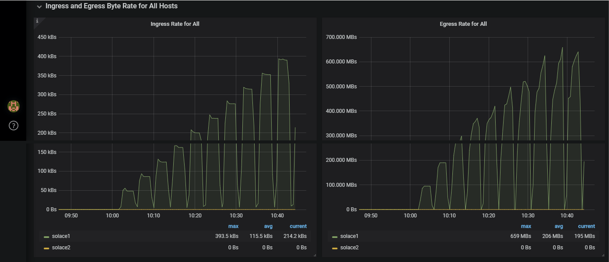

The last section on the page shows individual line charts for each Solace broker being monitored. They are the breakdown of the above charts. The motivation for these charts are to set the desired alert for threshold warning for individual Solace brokers and to give users a clearer picture on the throughput of each broker.

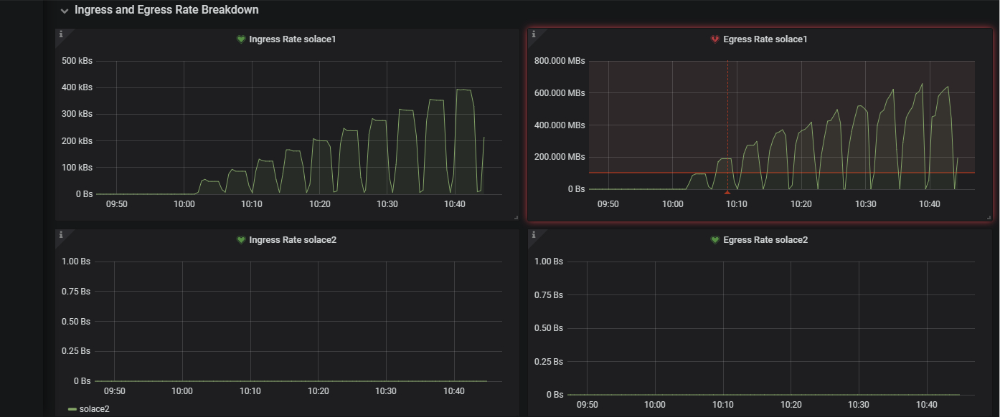

## Issues Count View
The *Issues Count View* shows the breakdown of various types of events logged in the specified Solace broker over the specified period of time. The information is retrieved from Elasticsearch where all the Solace event log entries are indexed and stored.

At the top of the dashboard, we can see the total number of event log entries over the chosen time window aggregated by severity. The pie chart shows the totals while bar chart shows the aggregates over time.

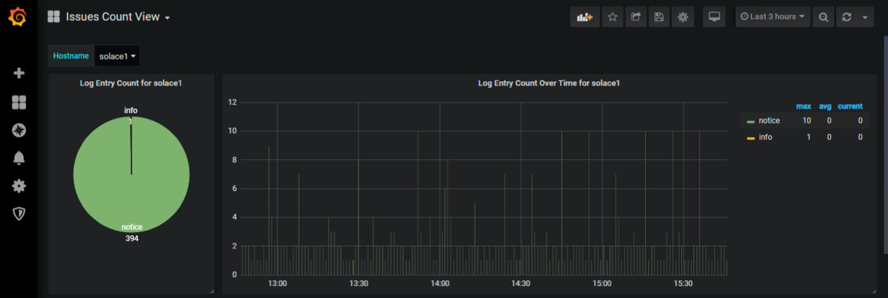

The second section shows a table which contains the count of each type of event in each severity level as recorded in the event log.

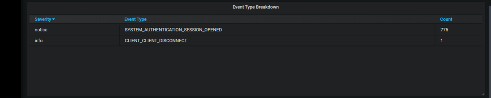

In daily operation, administrators are usually more concerned about the "issues" count. "issues" here refers to event of severity "warning" or above. The chart that immediately follows shows exactly that. Compared to the chart at the top of the dashboard, this one shows only the events count with severity "warning", "error" and "critical" over the specified period of time.

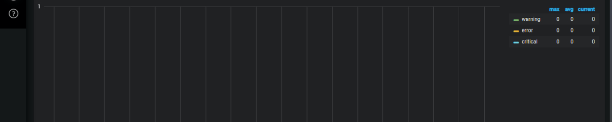


## System Level Stats
The *System Level Stats* shows a glance all the important metrics for a Solace PubSub+ Message Broker as a whole. To select the broker to view, users can choose from the drop down box on the top left ("Hostname").

The top most section shows the basic information like routername, hostname, management port IP and the configuration status of various services like SMF, Web and etc.

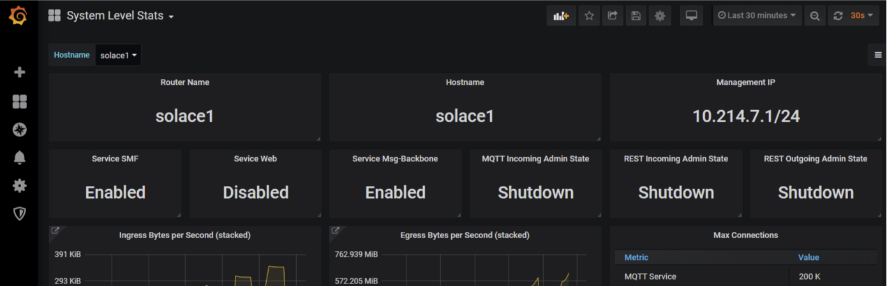

Immediately below that, the ingress/ egress byte rate and message rate are displayed as time-based line charts. In additional, the rates are broken down into control message and data message to give a better picture to the users on possible issues on the brokers. The charts stack data messages on top of control messages. Hence, the line for data messages actually shows the overall rates.

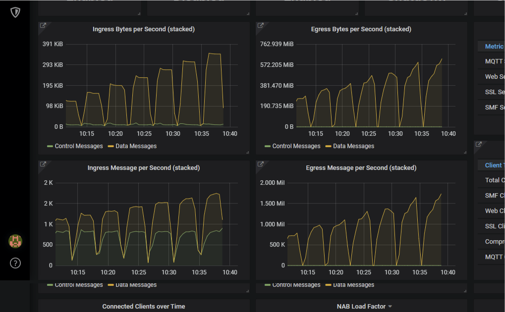

The next two charts below shows the number of connected clients and the NAB load factor changes over time. The connected clients chart gives users a concept of how many simultaneous client connects are there at any time and how they change over time. Users can compare this charts with the ingress/ egress rates charts to find any correlations. The NAB load factor chart is important in the sense that it indicates the utilization of the memory in the network acceleration blade (NAB). Its increase indicates the presence of a large number of slow consumers. When it is saturated, slow consumers would be dropped by the broker.

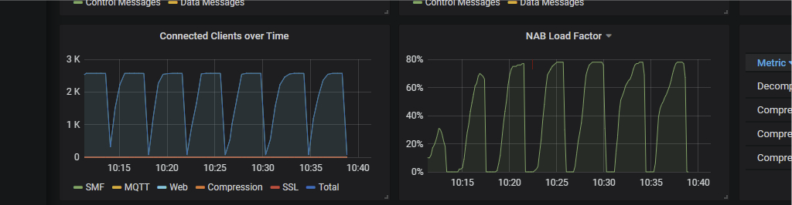

To have a breakdown of the connection count for different client types and system limits for them, two tables ("Max Connections" and "Connected Clients") on the right hand side can be referred to. They are shown below:

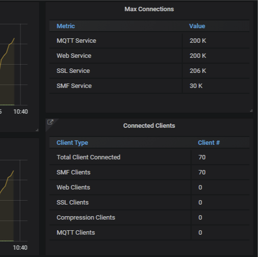

The last few charts at the bottom of the page shows the the compression related rates. The two "compressed rate per second" charts show the amount of compressed data (measured in bytes) received and sent by the broker. The two "uncompressed rate per second" charts show the amount of uncompressed data (measured in bytes) handled by the event broker. The figures encompass both uncompressed and compressed data. Compressed data is measured after it is uncompressed. All these charts together tells how much data has been compressed/ decompressed.

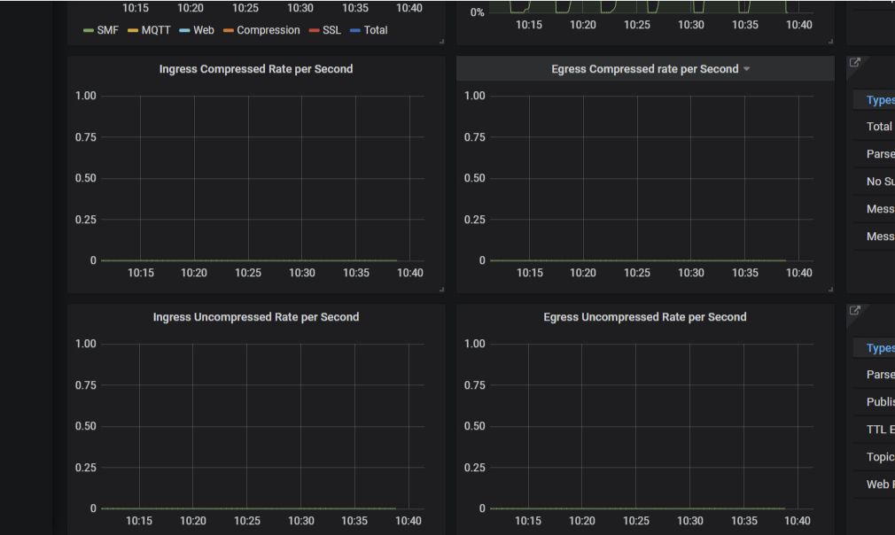

Besides the charts, the "Compression Stats Detail" on the right also shows some important metrics about compression in the last 30 secs. The “Work queue depth” reflects outstanding compression/decompression requests. The “Current” reflects the number of requests currently held in the queue. The “High Water Mark” reflects the highest number of requests held in the queue since the last clearing of statistics through the clear compression stats Privileged EXEC command.

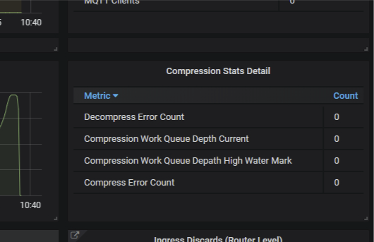

The last two tables on the bottom right shows the ingress discard statistics. They provide a breakdown of the reasons for all ingress message discards:

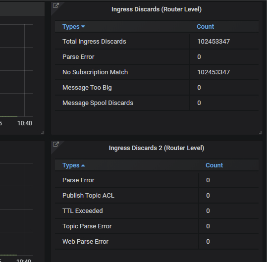

## VPN Level Stats
The *VPN Level Stats* is very similar to the *System Level Stats* discussed above. However, the charts displayed are all for a particular Message VPN the user has chosen on the drop boxes on the top left. The drop boxes let users to choose the desired broker and Message VPN to be monitored.

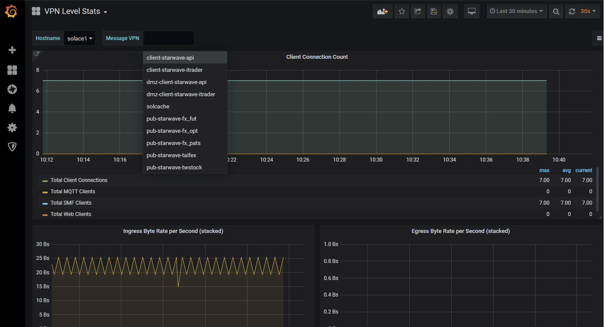

The page introduces a new chart not present in the *System Level Stats*. It's the "Subscription Break Down (VPN)" chart. While total number of topics is NOT a limit in Solace PubSub+, the number of unique subscriptions is. This chart shows the number of unique subscriptions over time.

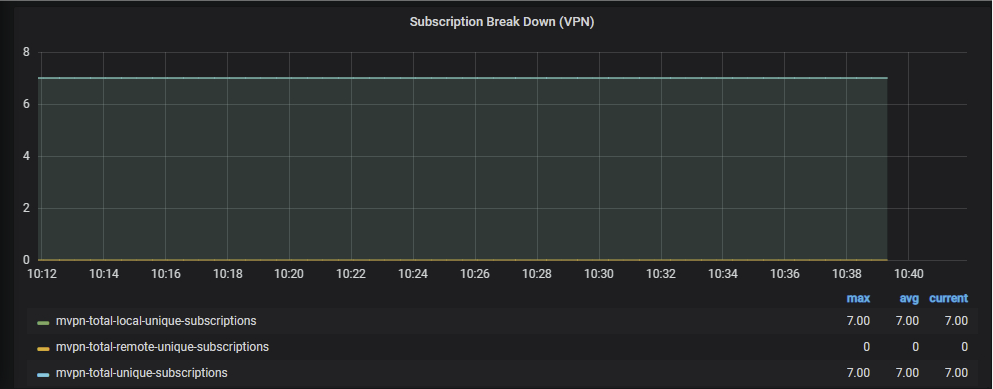

## Interface Stats
The *Interfaace Stats* page shows the recorded TX/ RX rates in terms of bytes and packets for each configured network interfaces of the Solace PubSub+ brokers. All the figures are the output of the "show interface" CLI command. Since Solace broker only updates the TX/ RX totals every 30 seconds. SolaceMonitor would only poll the stats every 30 seconds. Since the stats from "show interface" only shows the accumulated totals for both sent and received, we use InfluxDB's *derivative" function to calculate the rate of change per second (30 sec granularity in fact). The charts then all shows the TX/ RX rates.

The following diagram shows the TX/ RX byte rates for a specified network interface of a particular Solace broker:


The following diagram shows the TX/ RX packet rates:

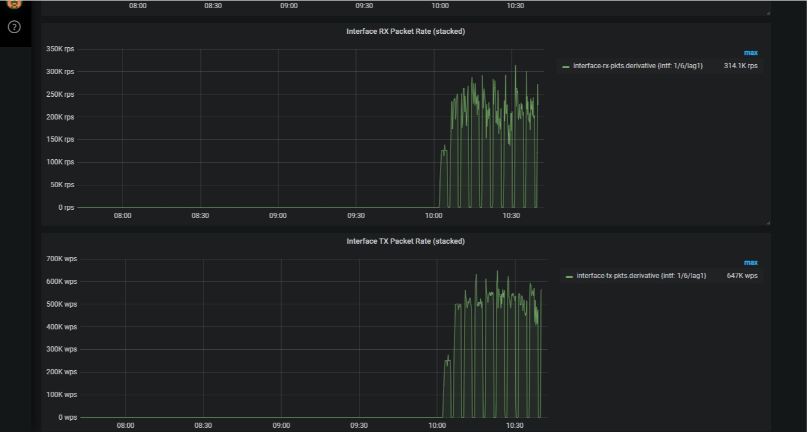

All other dashboards, users can choose which broker and which network interface to look into by clicking the drop down boxes on the top left of the page. And for network interfaces, multiple selection is allowed. When more than one interface are selected, all the charts would stack the rates from all selected interfaces together.

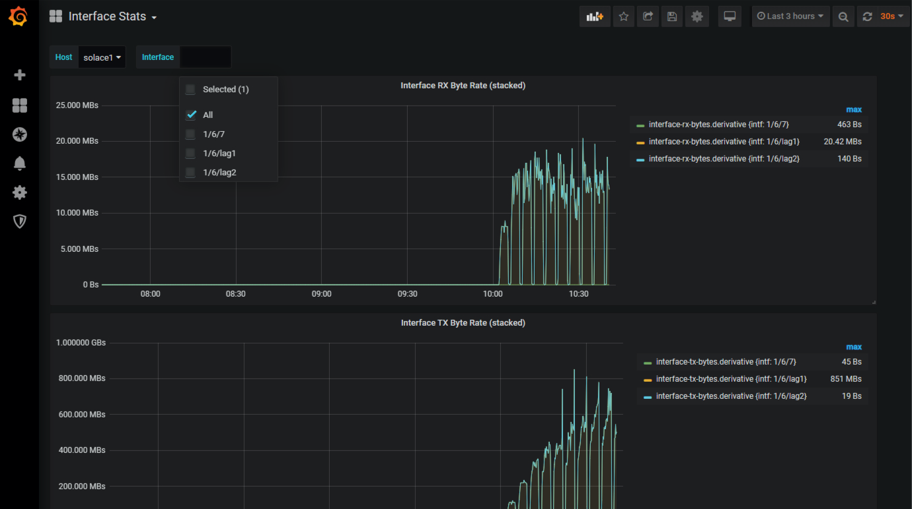

## SolCache Level Stats
The *SolCache Level Stats* provides a quick view on the healthiness of the each SolCache instance. Users can choose any configured SolCache Instance of any Message VPN in any Solace broker to look into.

The top section provides a quick view on the operational status of the configured clusters and instances for the chosen Message VPN. On the left hand side, the table "SolCache Distributed Cache Details" shows how many clusters and instances have been configured and how many of them are administratively set to "UP". The information here is rather static unless there's any change in the configuration. The right section shows whether the chosen SolCache instance's admin and operational status. If the admin status is "Up" and the "Operational Status" is "Down", it would mean that the SolCache instance is down or cannot connect to the Solace broker. The "Lost Message" box show whether the chosen instance is currently in a state of "lost message". "Lost message" state indicates that it could not receive all the messages it's supposed to receive and cache. It might indicate network hiccup or performance issue with the SolCache server.

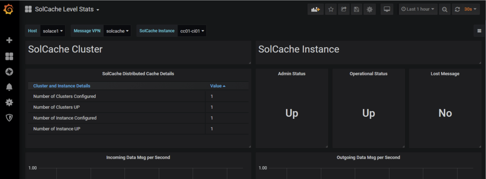

The "Loss Message Breakdown" table on the bottom right of the page also shows the reasons for lost messages:

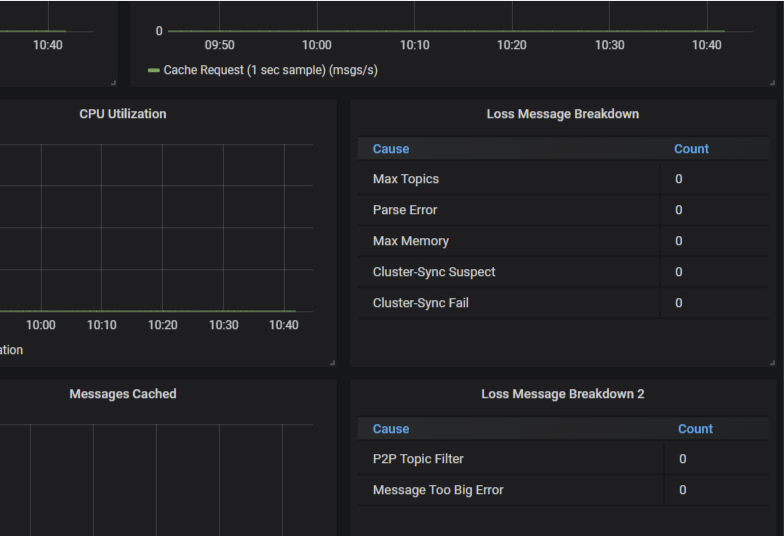

The next four charts below shows the incoming/ outgoing message/ data rates for the chosen SolCache instance. The words "incoming" and "outgoing" are relative to the Solace broker. They shows the throughput the instance is handling at the chosen time period.

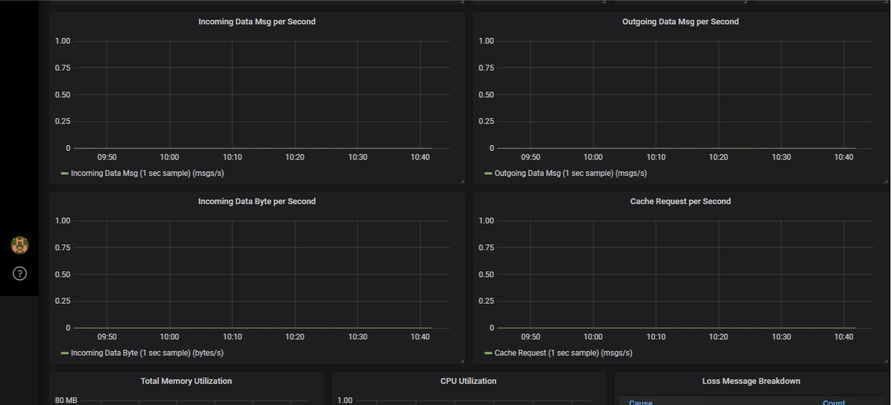

There last four charts at the bottom of the page show respectively the memory utilization, CPU utilization and the amount of messages cached (in bytes and messages) by the chosen SolCache instance.

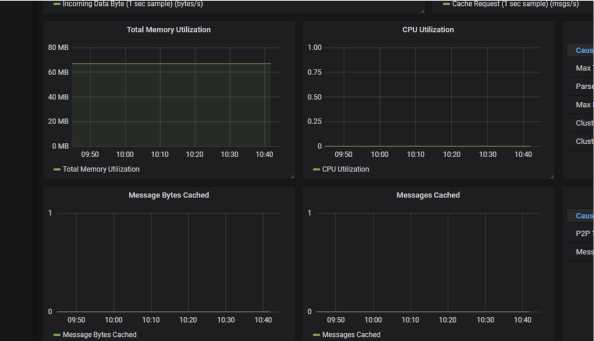

As with all dashboards, the broker, message VPN and SolCache instance can be chosen in the drop down boxes on the top left of the page.

## Bridges Stats
The *Bridges Stats* dashboard is a rather simple one. It shows mainly the chosen bridge's admin and operational status and the ingress/ egress throughput.

The screenshot below shows the top section where the admin and operation status are shown.

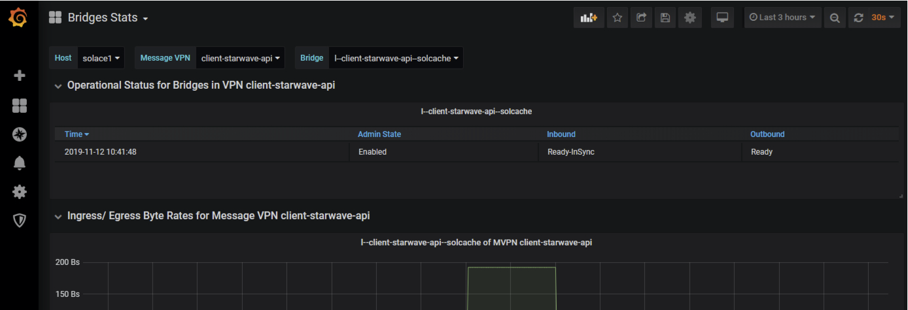

The rest of the page shows the ingress/ egress throughput of the chosen bridge:


The page enables users to choose multiple bridges inside a message VPN to display (drop-down boxes on the upper left). However, when multiple bridges are chosen, the page would become busy and hard to decipher. The following screen shows part of a busy page:

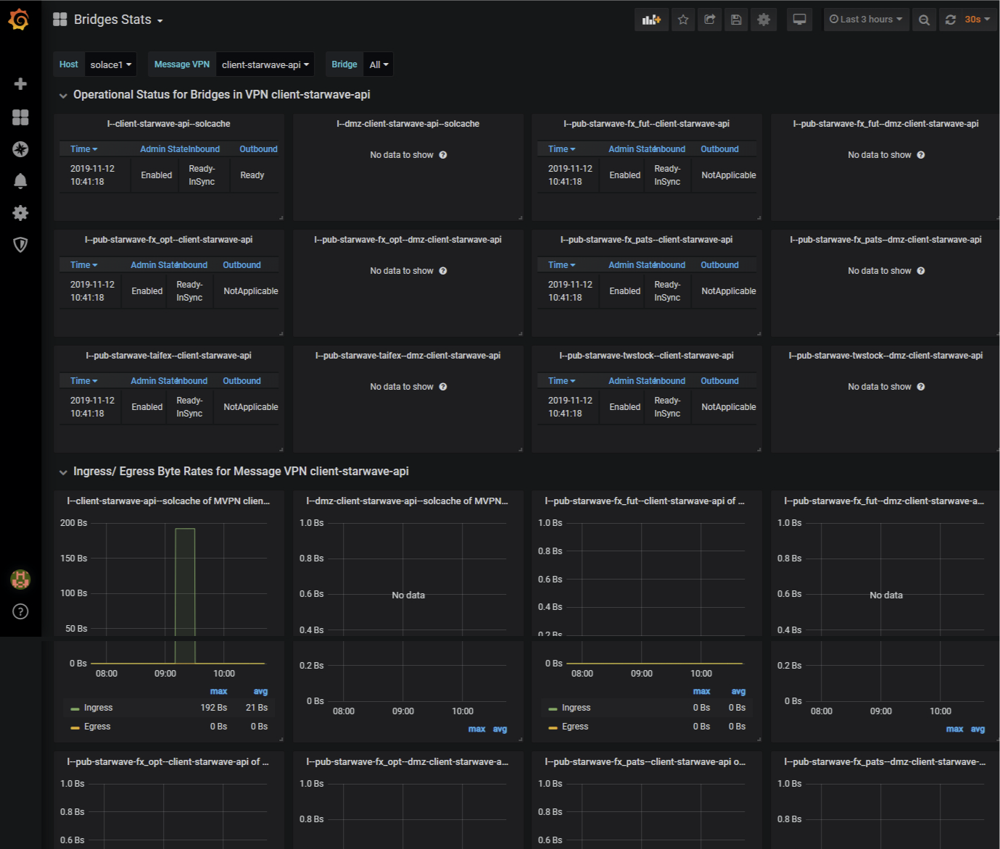

## SolaceMonitor Performance
This dashboard shows the performance of SolaceMonitor itself. It starts with the CPU, memory, disk and network utilization of the Linux server running the SolaceMonitor processes (InfluxDB and Grafana are running on the same server in most cases).

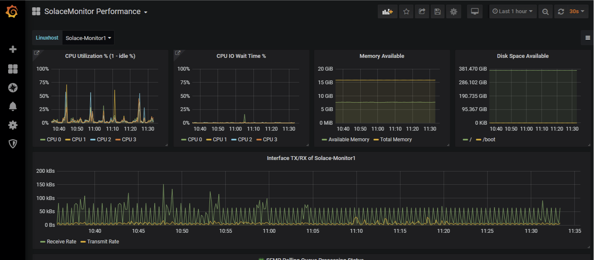

The subsequent charts on the page shows various metrics concerning the performance of SolaceMonitor. The most important of all is the "SEMP Polling Queue Processing Status". It shows the queue depth for each of the polling queues (10s, 30s, 60s, 120s, 300s). As we have discussed in the architecture section, SEMP replies collected by *pollrouter.js* would be written into *./processing/<interval>* directories first before being processed by *postdb.js*. If *postdb.js* cannot process the replies fast enough, they would be accumulated in the directories. This chart basically is telling how many pending replies are in each of the directories. Currently, there is an alert configured on the chart. If the queue depth for any polling interval exceeds 300, an alert would be raised.

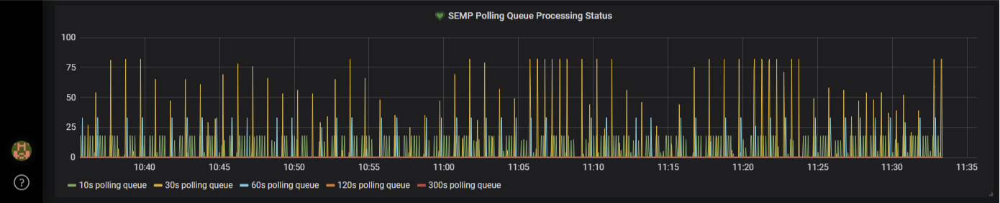

The rest of the charts on the same page shows the processing speeds and SEMP reply size for all different types of statistics. They are more for trouble-shooting in case the *postdb.js* is found not fast enough. 

## InfluxDB Performance
*InfluxDB* writes statistical and diagnostic information to database named _internal, which records metrics on the internal runtime and service performance. This dashboard visualizes some important metrics for easy monitoring and trouble-shooting. Metrics like average DB query duration, average HTTP request duration, heap usage, number of queries per seconds and etc are shown on the dashboard. For a more detailed discussion on the monitoring of various runtime metrics, please refer to this link: https://www.influxdata.com/blog/how-to-use-the-show-stats-command-and-the-_internal-database-to-monitor-influxdb/

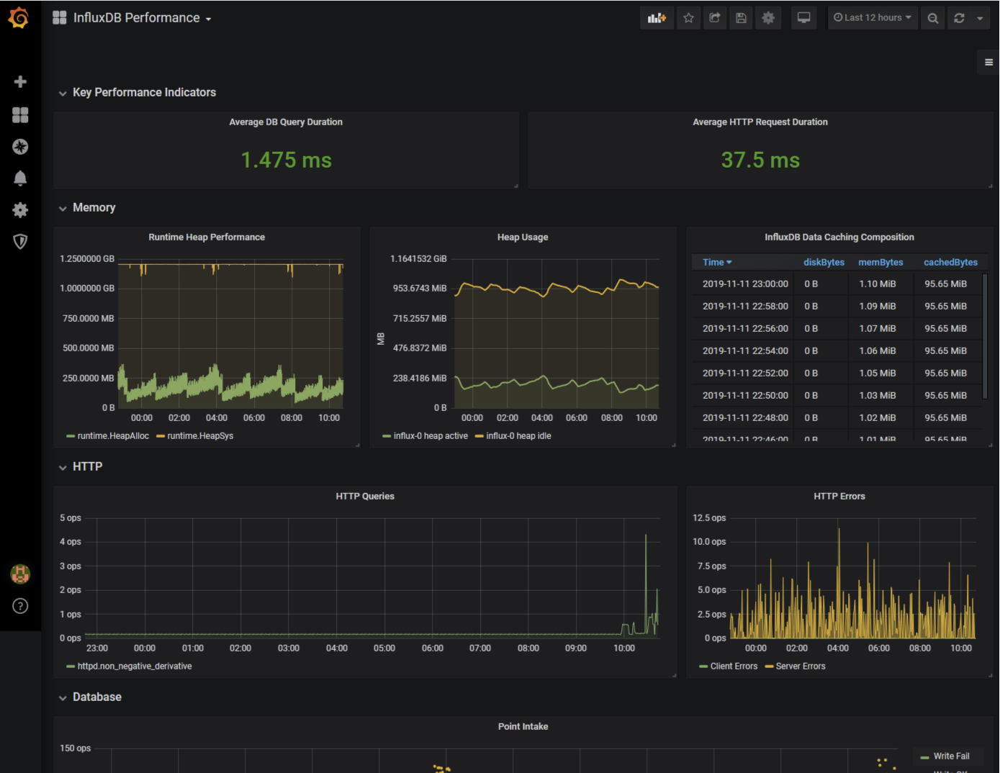

## Others
There are some other dashboards in SolaceMonitor which provides more detailed views on different aspects of Solace runtime metrics of minor importance. They're not detailed here.

# Reference
## SEMP Command template files
The SEMP command template files inside *cmd* directory all hava a fixed format. Each row contains a command template its associated processing type and polling time inteval:

    <type> <interval> <SEMP command template>

Where

+ <type> - signifies the type of processing it's needed in *postdb.js*. A new type would means a new processing routine in *postdb.js*.
+ <interval> - the polling time interval in seconds.
+ <SEMP command template> - the command template itself. It may contain variables that would be replaced with values from the *list* files in the *config* directory.

An example is shown here as a reference (from *mvpncmdlist*):

    M2 60 <rpc semp-version="SOLTRV"> <show> <message-spool> <vpn-name>VPN</vpn-name> </message-spool> </show> </rpc>

Both "SOLTRV" and "VPN" in the command template would be replaced with the relevant values from *config/mvpnlist* file when *pollrouter.js* is executed. To learn exactly which variable would be replaced by which value, please refer to *pollrouter.js*. 

## Environment Variables
This section list out all the environment variables to be read by various *SolaceMonitor* for its behaviour fine-tuning. They can be passed to the *docker create* command.

| Variable                         | Description                                                                                | Default | Allowable Values | Read By       |
|----------------------------------|--------------------------------------------------------------------------------------------|---------|------------------|---------------|
| SMON_RESPONSES_ARCHIVE_INTVL_SEC | Response files would be compressed every ? seconds                                         | 600     | 30 - 1800        | compress.sh   |
| SMON_RESPONSES_ARCHIVE_DAYS      | Compressed responses files would kept ? number of days and then would be removed           | 14      | 1-360            | compress.sh   |
| SMON_RESPONSES_ARCHIVE_FILES     | Max number of reponse files to be compressed each time                                     | 10000   | 500-90000        | compress.sh   |
| SMON_IS_ARCHIVE_RESPONSES        | Whether to archive the processed response files                                            | TRUE    | TRUE or FALSE    | postdb.js     |
| SMON_ROUTER_PING_INTVL_SEC       | Each router would be pinged every ? seconds to detect its presence and its network latency | 60      | 15-600           | pingrouter.sh |